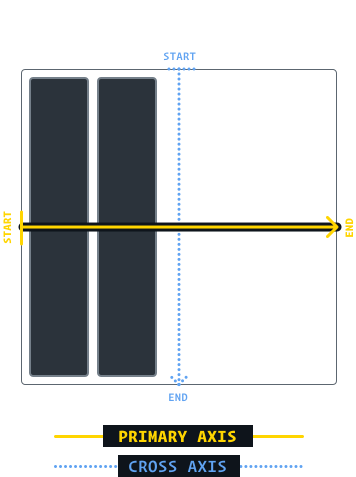

# [Flex](https://www.theodinproject.com/lessons/foundations-introduction-to-flexbox#how-to-create-flex-item-knowledge-check)

```css
.flex-container {
  display: flex;
}
```

- A **flex container** is any element that has display: flex on it. 
- A **flex item** is any element that lives directly inside of a flex container.
- flex is actually a shorthand for flex-grow, flex-shrink and flex-basis (Shorthand properties are CSS properties that let you set the values of multiple other CSS properties simultaneously)

1. flex-grow: When we applied "flex-grow: 1" to every div inside our container, we were telling every div to grow the same amount
2. flex-shrink: 1, which means all items will shrink evenly. If you do not want an item to shrink then you can specify flex-shrink: 0;
3. flex-basis sets the initial size of a flex item, so any sort of flex-growing or flex-shrinking starts from that baseline size

### In practice…

In practice you will likely not be using complex values for flex-grow, flex-shrink or flex-basis. Generally, you’re most likely to use declarations like flex: 1; to make divs grow evenly and flex-shrink: 0 to keep certain divs from shrinking.

## Axes

.flex-container {
  flex-direction: column;
}

1. flex-direction: row which arranges things horizontally
2. flex-direction: column which arranges things vertically

when we changed the flex-direction to column, flex-basis refers to height instead of width

## Alignment



In Flow layout, width is a hard constraint. When we set width: 2000px, we'll get a 2000-pixel wide element. In Flexbox, however, the width property is implemented differently. It's more of a suggestion than a hard constraint


1. **flex: 1;** (1 1 0) to .item makes each of the items grow to fill the available space,
2. Removing "flex: 1;" from .item and adding **justify-content: space-between** to *.container*  , doing so should give you something like this:


3. **justify-content:** Justify in the primary-axis direction. 
Also *flex-start, center, flex-end, space-between, space-around, space-evenly.*
4. **align-items: center;** Justify items in the cross-axis direction. Also *stretch, flex-start, center, flex-end, baseline*.
5. **align-self** Justifies child element along cross-axis.
5. **gap: 8px;**  specifies a space between flex items in a container.
6. **min-width: auto;** (default) defines thedepends on the navigator, can be changed to 0.
7. **margin: auto** adds space around an element. Also margin-right, margin-left
8. **flex-wrap: wrap** items will break a line instead of shrinking more than the min size.
9. **flex-direction: column** define como os itens flexíveis são colocados no contêiner flexível, definindo o eixo principal e a direção (normal ou invertido). Also: row-reverse, row, column-reverse.

justify — to position something along the primary axis.

align — to position something along the cross axis.

content — a group of “stuff” that can be distributed.

items — single items that can be positioned individually.

